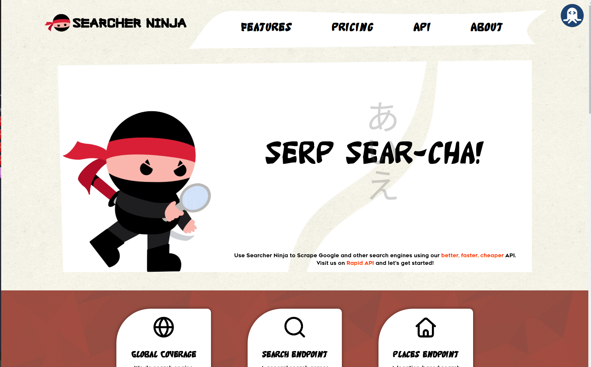
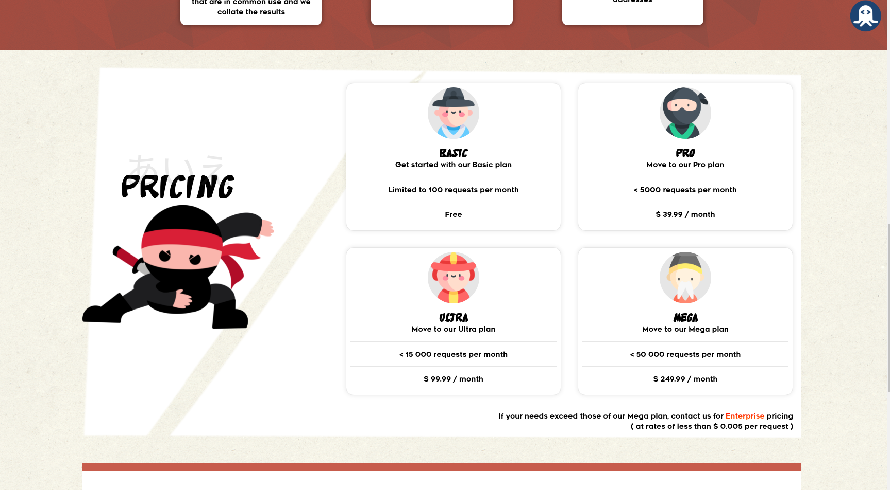
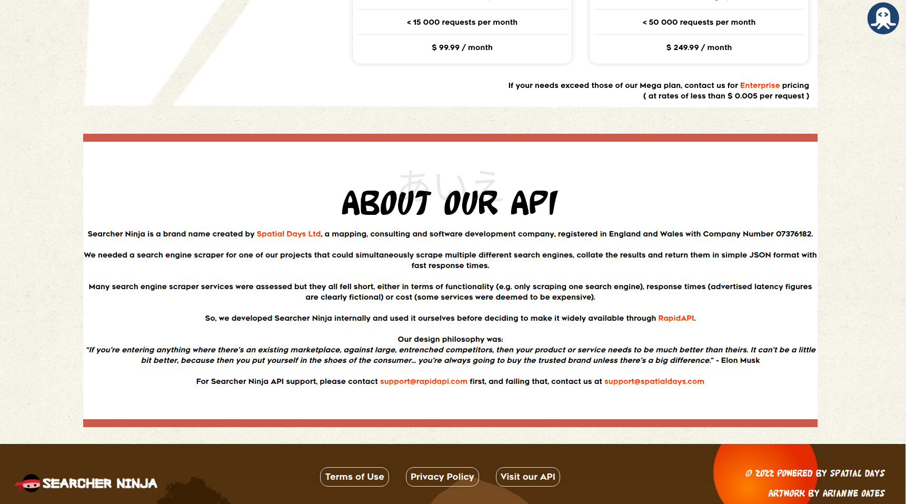

# Searcher Ninja

## Website 
https://searcher.ninja/

## RapidAPI link
https://rapidapi.com/spatialdays-spatialdays-default/api/searcher-ninja1/

## Who we are
Searcher Ninja is a brand name created by Spatial Days Ltd, a mapping, consulting and software development company, registered in England and Wales with Company Number 07376182.

We needed a search engine scraper for one of our projects that could simultaneously scrape multiple different search engines, collate the results and return them in simple JSON format with fast response times.

Many search engine scraper services were assessed but they all fell short, either in terms of functionality (e.g. only scraping one search engine), response times (advertised latency figures are clearly fictional) or cost (some services were deemed to be expensive).

So, we developed Searcher Ninja internally and used it ourselves before deciding to make it widely available through RapidAPI.

Our design philosophy was:
“If you're entering anything where there's an existing marketplace, against large, entrenched competitors, then your product or service needs to be much better than theirs. It can't be a little bit better, because then you put yourself in the shoes of the consumer... you're always going to buy the trusted brand unless there's a big difference.” - Elon Musk

For Searcher Ninja API support, please contact support@rapidapi.com first, and failing that, contact us at support@spatialdays.com

## Showcase

### Landing

</img>
 
 

### Pricing

 
 

### About

